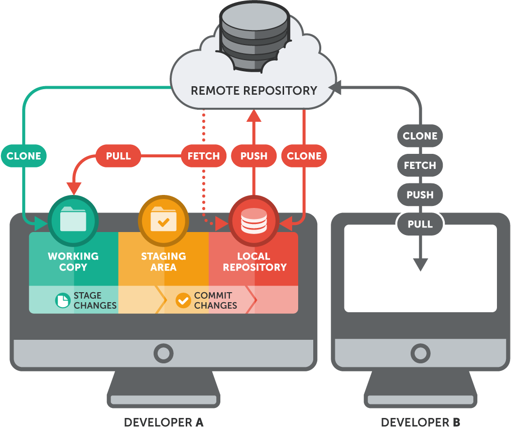
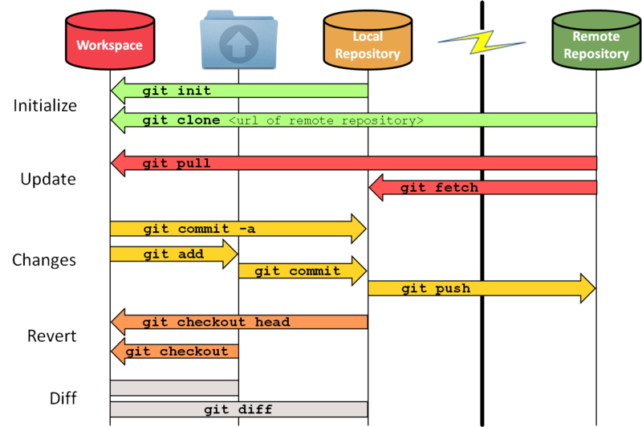

# Sesion 1 - Linea Comandos, Git y Markdown (09-04-2019) 

https://vimeo.com/329760654

- Presentaciones

## Linea Comandos

- [The Command Line](http://cli.learncodethehardway.org/book/)
  - Make A Directory `mkdir`
  - Change Directory `cd`
  - List Directory `ls`

- [**Cmder**](http://cmder.net/) => Command line for Windows Users
  - [Guide for setting up Sublime](http://laravel.io/forum/02-24-2014-a-neat-way-integrate-cmder-and-sublime-text-seamlessly)
  - [Sublime 3 Portable](https://download.sublimetext.com/Sublime%20Text%20Build%203083.zip)
  - Use `bash` to enter into _UNIX mode_

- [**Learn the Command Line** | codeCademy](https://www.codecademy.com/learn/learn-the-command-line)

## Git

- [Version Control](http://git-scm.com/video/what-is-version-control). [What?](https://diigo.com/08braq) [Why?](https://diigo.com/08brk8)
- [**Git**](http://git-scm.com/)
  - Installation from [http://git-scm.com/downloads](http://git-scm.com/downloads) 
 
   
  - [Command Line or GUI](https://www.git-tower.com/learn/git/ebook/command-line/basics/getting-ready#chapter) 
  <a class="icon-" href="https://www.sourcetreeapp.com/"> </a> 

  - [Basic Configuration](https://www.git-tower.com/learn/git/ebook/command-line/basics/getting-ready#chapter) `git config`
  - [Git Workflow](https://diigo.com/08brpz) 
  - [Local Repository (and first steps)](https://www.git-tower.com/learn/git/ebook/command-line/basics/starting-with-an-unversioned-project#start) `git init`
  - [Working w/ existing Project on a Server](https://www.git-tower.com/learn/git/ebook/command-line/basics/starting-with-a-remote-project#start) `git clone`

* [Working on Your Git Project](https://www.git-tower.com/learn/git/ebook/command-line/basics/working-on-your-project#start)
  * Staging Area `git add`
  * View your changes `git status`
  * Committing Your Work `git commit`
  * Commit History `git log`

---

---

- Remote repositories
  - [Connecting a Remote Repository](https://www.atlassian.com/git/tutorials/syncing/git-remote) `git remote add` [[1]](https://diigo.com/08brzy)
  - [_Uploading_ data to a Remote Repository](https://www.atlassian.com/git/tutorials/syncing/git-push) `git push`
  - [_Integrating_ remote changes](https://www.atlassian.com/git/tutorials/syncing/git-pull) `git pull` => [`git fetch`](https://www.atlassian.com/git/tutorials/syncing/git-fetch) + `git merge`

---

---

---

## Visual Code

- https://code.visualstudio.com/

## Markdown

- [**Markdown**](https://daringfireball.net/projects/markdown/syntax)
  - [Markdown Guide](https://blog.ghost.org/markdown/) [[1]](http://markdown-guide.readthedocs.org/en/latest/basics.html)

---

### Ejercicio: Create Local Repo & Synchronize w/ Remote Repo

1. Create a local repo in your computer
1. Create a README.md
1. Document a few commands seen in the session
1. Commit the changes to your local repo
1. Synchronize the changes w/ your remote repo
1. Share the URL of your remote repo 

---

